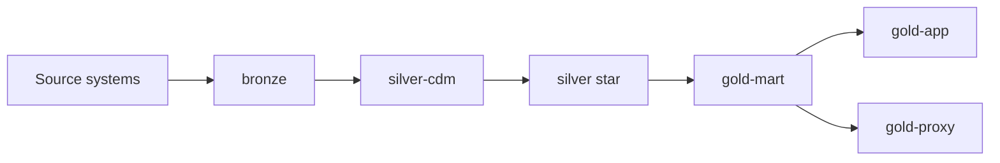

# Design Spec: [Domain Name]

> **Template:** `docs/data-engineering/templates/design-spec-template.md`  
> **Save to:** `docs/data-engineering/specs/YYYY-MM-DD-<domain>-design.md`

## 1. Problem & goals

### Business context

_[What business capability this pipeline supports]_

### Success criteria

- [ ] _Measurable outcome 1_
- [ ] _Measurable outcome 2_

### Iteration scope

**Layers in scope for this iteration:** _e.g. bronze → silver-cdm (stop before silver-ref)_

**Source systems:** _list_

---

## 2. Approach comparison

### Option A — _name_

**Summary:** _…_

**Pros:** _…_  
**Cons:** _…_

### Option B — _name_

**Summary:** _…_

**Pros:** _…_  
**Cons:** _…_

### Option C — _name_ (optional)

**Summary:** _…_

### Recommendation

**Chosen:** _Option X_

**Why not the others:** _…_

---

## 3. Data architecture

### Architecture mode

- [ ] Extended Medallion (this fork default)
- [ ] Other: _describe_

### Layer taxonomy (check layers used)

| Layer | Purpose in this domain |
|-------|------------------------|
| bronze | |
| silver-cdm | |
| silver-ref | |
| silver (star schema) | |
| gold-mart | |
| gold-app | |
| gold-proxy | |

### Lineage (design)

### Table inventory (by layer)

| Layer | Target table | Source | Status |
|-------|--------------|--------|--------|
| bronze | _tbd_ | | Planned / TBD |
| silver-cdm | | | |

### Cross-layer decisions (MUST be decided — no TBD at DesignApproved)

| Topic | Decision |
|-------|----------|
| Incremental / watermark strategy | |
| Idempotency & rerun policy | |
| Timezone | |
| Schema drift handling | |
| Shared reference tables | |

---

## 4. Risks, gates & open items

### Quality & reconciliation

- **GE strategy:** _suite vs checkpoint per layer_
- **Reconciliation:** _row counts, KPIs, compare-to source_

### Orchestration boundaries

- **Airflow:** _DAG ownership, env promotion_
- **Databricks:** _jobs vs notebooks, workspace_

### Known risks

| Risk | Mitigation |
|------|------------|
| | |

### Open questions

| # | Question | Owner | Must resolve before plan? |
|---|----------|-------|---------------------------|
| 1 | | | yes / no |

### Must close before plan (DesignApproved checklist)

- [ ] Cross-layer incremental strategy decided
- [ ] Idempotency policy decided
- [ ] Layer order for this iteration decided
- [ ] GE / reconciliation approach agreed
- [ ] All "Must resolve before plan = yes" items closed

---

## Approval

> Required before invoking `data-pipeline-plans`. Cross-layer contracts above must have no TBD.

| Field | Value |
|-------|-------|
| **Approved by** | |
| **Date** | |
| **Scope snapshot** | _layers and domains in scope_ |
| **Allowed table-level TBD** | _list tables or fields that may stay TBD in STTM during plan_ |
| **Human sign-off quote** | _paste exact approval message_ |

**DesignApproved:** ☐ Pending → set to Approved when complete
