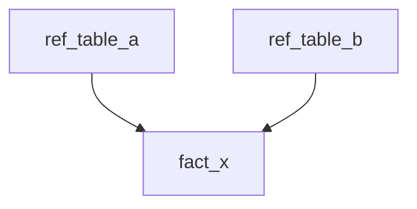

# Layer Plan: [Layer Name] — [Domain]

> **Template:** `docs/data-engineering/templates/layer-subplan-template.md`  
> **Path:** `docs/data-engineering/plans/YYYY-MM-DD-<domain>/0N-<layer>.md`  
> **Prerequisites:** DesignApproved; previous layer ExecutionSignOff (if not first layer)

## Layer metadata

| Field | Value |
|-------|-------|
| **Layer** | _e.g. silver-cdm_ |
| **Overview** | [00-overview.md](./00-overview.md) |
| **PlanApproved** | ☐ Pending — _human must reply before execution_ |
| **Previous layer sign-off** | [99-gates-signoff.md#layer-...](./99-gates-signoff.md) |

## Layer dependency order

Define table order within this layer before task groups (ref/dims before facts).



| Order | Table | Depends on |
|-------|-------|------------|
| 1 | | |
| 2 | | |

---

## Task group: [target_table]

**STTM:** [../../sttm/<domain>/<target_table>.yaml](../../sttm/<domain>/<target_table>.yaml)

| Field | Value |
|-------|-------|
| **Target layer / table** | |
| **Upstream tables** | |
| **Incremental key / partition** | |
| **Load type** | full / incremental / merge |
| **Airflow DAG / task** | |
| **Databricks job / notebook** | |
| **GE expectations** | _list or suite ref_ |
| **Reconciliation** | _SQL or KPI_ |
| **Lineage update** | `./lineage/0N-<layer>.mmd` node `[table]` |
| **Design reference** | design spec §… |
| **Sign-off item** | 99-gates-signoff §Layer-[name] |
| **Done definition** | pytest + GE green; STTM impl fields updated; Airflow wired; lineage updated |

### Micro-steps (execute in order)

- [ ] **1.** Confirm STTM frozen fields match PlanApproved snapshot
- [ ] **2.** Write **failing** pytest (transform logic) + **failing** GE expectations
- [ ] **3.** Implement PySpark / SQL transform
- [ ] **4.** Run dev Databricks job — pass
- [ ] **5.** Update lineage `.mmd` + STTM `implementation_detail` fields
- [ ] **6.** Wire Airflow task; dev DAG run green
- [ ] **7.** Commit

### Verification commands

```bash
pytest tests/.../test_<target_table>.py -v
great_expectations checkpoint run <checkpoint_name>
# If incremental/merge — idempotency (required):
pytest tests/.../test_<target_table>_idempotency.py -v
```

---

## Next layer

**Do not write** `0{N+1}-<next-layer>.md` until this layer's ExecutionSignOff is complete in `99-gates-signoff.md`.
