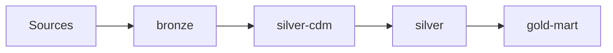

# Overview: [Domain Name]

> **Template:** `docs/data-engineering/templates/overview-template.md`  
> **Path:** `docs/data-engineering/plans/YYYY-MM-DD-<domain>/00-overview.md`  
> **Derived from:** `docs/data-engineering/specs/YYYY-MM-DD-<domain>-design.md`

Thin execution view (2–3 pages). No long option comparisons—those stay in the design spec.

## 1. Business & scope

| Field | Value |
|-------|-------|
| **Domain** | |
| **Design spec** | [link](../specs/...) |
| **Iteration layer stop** | _e.g. through silver-cdm_ |
| **Source systems** | |

## 2. Architecture & lineage

### Summary diagram

_Full per-layer diagrams: `./lineage/`_

### Table inventory

| Layer | Table | STTM | Plan file | Status |
|-------|-------|------|-----------|--------|
| bronze | | [sttm](../../sttm/...) | 01-bronze.md | planned / dev / done |

## 3. Cross-layer contracts

| Topic | Decision (from design) |
|-------|------------------------|
| Incremental / watermark | |
| Idempotency & rerun | |
| Timezone | |
| Schema drift | |
| Shared ref tables | |

## 4. Gates, docs & naming

| Artifact | Location |
|----------|----------|
| Sign-off log | [99-gates-signoff.md](./99-gates-signoff.md) |
| STTM root | `docs/data-engineering/sttm/<domain>/` |
| GE strategy | _checkpoint names / suite policy_ |

### Naming conventions

| Type | Pattern |
|------|---------|
| Airflow DAG | `de_<domain>_<layer>` |
| Airflow task | `<layer>__<target_table>` |
| Databricks job | `de-<domain>-<layer>-<table>` |

### Approval flow

1. **DesignApproved** — design spec Approval block
2. **PlanApproved** — per layer sub-plan, before execution
3. **ExecutionSignOff** — per layer, before next layer plan

## Changelog (rolling updates)

| Date | Layer | Change |
|------|-------|--------|
| | | Initial overview from design |
